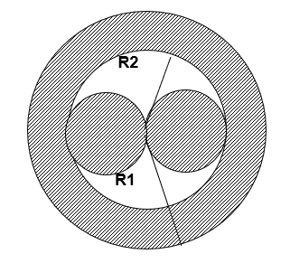

# Programming I

___

## Test 1

`if`, `else`, `esle if` statements, `for`, `while`, `do while` loops and random number generation.

### [Task 1a](01-test/01a-task)

Write a program that checks the input n to see if it is a palindrome.

### [Task 1b](01-test/01b-task)

Write a program that outputs all six-digit palindromes.

### [Task 2](01-test/02-task)

A game must be written. The program guesses a number between 0 and 100.
The user has to guess the number by entering guessing options on the keyboard.

After each attempt, the program outputs one of three messages:<br>
"number is greater than entered",<br>
"number is less than entered",<br>
"number guessed from N attempts".<br>

The maximum number of attempts is 10.<br>
If the number was not guessed out of 10 attempts, the program should output a message:<br>
"You lose! The correct answer is N".

### [Task 3](01-test/03-task)

A game must be written. The user comes up with a number and the program tries to guess it.<br>
The program needs to guess a number with 10 tries.

___

## Test 2

Functions

### [Task 1](02-test/01-task)

Describe the function `double circle_area(double R)` which calculates the area of the circle, (R - radius of the
circle). Using this, calculate the area of the hatched figure by asking for R1 and R2.<br>


### [Task 2](02-test/02-task)

In a parking lot, the minimum cost of parking is 2 euro. In case the car stays in the parking lot for more than 3 hours,
in addition, pay 0,50 euro for every hour. But the maximum daily fee is 10 euro. Write a function which receives the
number of hours as parameter, and calculates a fee for the parking (nobody leaves a car for more than 24-hours).
Example:

```
1.5 -> 2.00
4.0 -> 2.50
24.0 -> 10.00
```

### [Task 3](02-test/03-task)

Define a function `int vms (int Vkmh)` that converts speed `Vkmh` from km/h to m/s.<br>
Use this function in another function `int meet_time(int kmh1, int kmh2, int km)` where `kmh1` and `kmh2` two toward
moving object speeds, and `km` distance between these objects.<br>
Function need to return this object meet time in seconds.

___

## Test 3

Arrays

### [Task 1](03-test/01-task)

Using random generator, fill a two-dimensional array NxN with numbers in the range of 10-99, and display it on the
screen. Rotate the array to 90° clockwise. Display the result on the screen.

### [Task 2](03-test/02-task)

Program a "tic tac to" game.<br>
The program provides a playing field for two players, checks the correctness of the moves, follows the situation on the
field, and outputs the boiler.<br>
The program plays against the person, looking for the most advantageous option in the current situation at each
turn.<br>
At the beginning, you can choose to play against a person or against the computer. At the end of the game, you are
offered to play again.<br>

___

## Test 4

### [Task 1](04-test/01-task)

Create a program that prompts the user to input a time in the format hh:mm:ss. The program should then validate the
input and provide appropriate feedback.<br>
Examples:
<li>23:09:03 - Correct input
<li>2:2:2 - Incorrect format. Please use hh:mm:ss format
<li>12:02:94 - Invalid time. Hours, minutes, or seconds out of range
<li>14.05.35 - Incorrect format. Please use only digits and colons
<li>qw2:we34 - Incorrect format. Please use only digits and colons

### [Task 2](04-test/02-task)

Objective:
Create a simple word guessing game in which the player must guess words from a predefined list. The game will continue
until the player accumulates 10 penalty points or enters "0" instead of a letter. The player earns a point for each
incorrect guess and burns 5 penalty points after each successful guess. The goal is to guess as many words as possible.

Instructions:
<li>Prepare an array containing at least 20 words that will be used in the game.
<li>When the game starts, randomly select a word from the array using a random number generator.
<li>Display the selected word as a series of dots (e.g., "....") representing the number of letters in the word. Replace dots with correctly guessed letters.
<li>Allow the player to input letters one at a time without pressing "Enter" after each letter.
<li>For each incorrect letter guessed, assign 1 penalty point to the player.<br>
<li>Continue the game until one of the following conditions is met:
<ul>The player accumulates 10 penalty points.</ul>
<ul>The player enters "0" instead of a letter.</ul>
<li>After each successful word guess, subtract 5 penalty points from the player's score, but ensure the penalty points never go below zero.
<li>Offer a new word for the player to guess after each successful guess, ensuring that words are not repeated.
<li>At the end of the game, display the number of words successfully guessed by the player.
<li>If the player successfully guesses all the words without accumulating 10 penalty points, congratulate them on winning the game.

___

## Test 5

Coming soon
